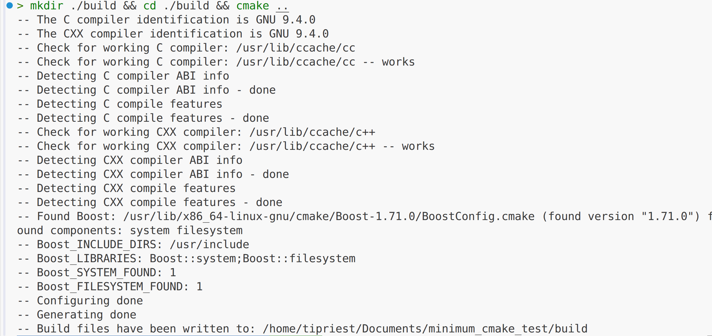
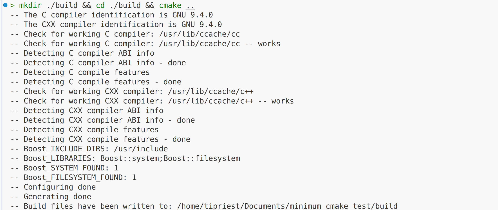

# minimum_cmake_test


CMakeLists.txt
find_package without `NO_MODULE`
```bash
find_package(Boost REQUIRED COMPONENTS system filesystem)
```


---
find_package with `NO_MODULE`
```bash
find_package(Boost REQUIRED COMPONENTS system filesystem)
```
